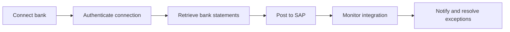

# Finance and integration

This space brings together Aiden's finance and integration surfaces: Bank Connectivity, Aiden Connect, SAP data exchange, Peppol, exchange rates, payment workflows, and integration monitoring.

<table data-view="cards">
  <thead><tr><th width="48"></th><th></th><th></th><th data-hidden data-card-target data-type="content-ref"></th></tr></thead>
  <tbody>
    <tr><td><i class="fa-building-columns" style="color:#0E8F72;"></i></td><td><strong>Bank Connectivity</strong></td><td>Connect banks, authenticate access, retrieve bank statements, manage organizations, and monitor notifications.</td><td><a href="bank-connectivity/overview.md">bank connectivity</a></td></tr>
    <tr><td><i class="fa-diagram-project" style="color:#0E8F72;"></i></td><td><strong>Aiden Connect</strong></td><td>Integration services, standard integrations, SAP exchange rates, PDF invoice scanning, and Peppol flows.</td><td><a href="aiden-connect/integration-services.md">integration services</a></td></tr>
    <tr><td><i class="fa-shield-halved" style="color:#0E8F72;"></i></td><td><strong>Controls</strong></td><td>Prerequisites, security checks, notifications, release notes, and support escalation for business-critical flows.</td><td><a href="controls/prerequisites-and-security.md">controls</a></td></tr>
  </tbody>
</table>

## Finance workflow

