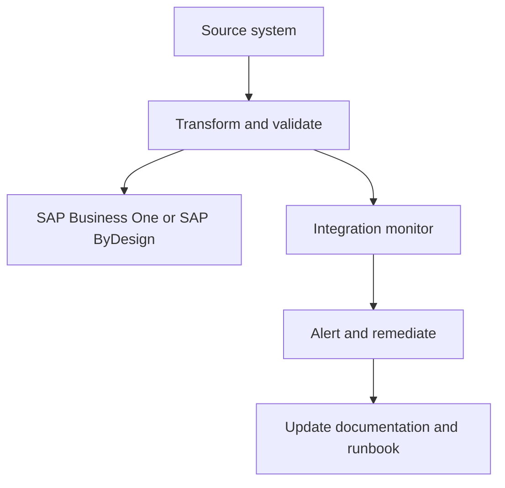

# Integration services

Aiden Connect helps customers keep applications using the same data across an application landscape. The demo positions integration services as a managed operating layer, not just a list of connectors.

## Integration lifecycle

## Example integration topics

- PDF invoice scanning to SAP ByDesign.
- Exchange rate information for SAP Business One.
- Exchange rate information for SAP ByDesign.
- Aiden Connect Peppol.
- HTTPS prerequisites.


Aiden Connect is a strong place to show GitBook AI answering cross-system questions because the value comes from understanding dependencies across systems.

