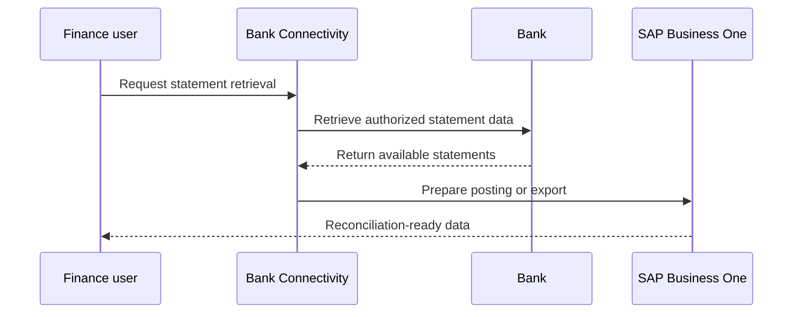

# Retrieve bank statements

Bank statement retrieval is the recurring operational moment where connectivity, authentication, and SAP data handling come together.

## Retrieval flow

## Operational checks

- Connection is active and not expired.
- The target bank account belongs to the right organization.
- Statement period and currency match finance expectations.
- Notifications are reviewed for authentication or retrieval exceptions.
