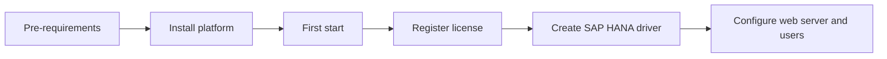

# Platform operations

This space gathers the material that makes Aiden's product portfolio operational: B1ProSuite setup, configuration, identity, support escalation, releases, and governance.

<table data-view="cards">
  <thead><tr><th width="48"></th><th></th><th></th><th data-hidden data-card-target data-type="content-ref"></th></tr></thead>
  <tbody>
    <tr><td><i class="fa-server" style="color:#0E8F72;"></i></td><td><strong>B1ProSuite</strong></td><td>Pre-requirements, installation, first start, license registration, HANA driver creation, and web configuration.</td><td><a href="b1prosuite/overview.md">B1ProSuite overview</a></td></tr>
    <tr><td><i class="fa-user-shield" style="color:#0E8F72;"></i></td><td><strong>Access and identity</strong></td><td>User creation, Microsoft Entra, portal roles, and access control across POS, WMS, and platform portals.</td><td><a href="access/user-management-and-entra.md">access guidance</a></td></tr>
    <tr><td><i class="fa-headset" style="color:#0E8F72;"></i></td><td><strong>Support and governance</strong></td><td>Managed Services portal, incidents, change requests, release notes, and documentation operating model.</td><td><a href="access/managed-services-support.md">support model</a></td></tr>
  </tbody>
</table>

## Platform setup flow

