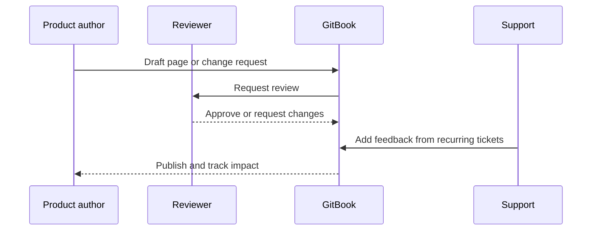

# Documentation operating model

Aiden's current Confluence model likely reflects product ownership. GitBook can keep that ownership while adding clearer review, publishing, and analytics workflows.

## Suggested governance

- Product owners own accuracy for POS, WMS, Bank Connectivity, Aiden Connect, and B1ProSuite areas.
- A central documentation owner governs navigation, naming, style, redirects, and duplicate-content reduction.
- Support owns recurring issue feedback and article improvement requests.
- Implementation partners can receive adaptive or gated deeper setup pages when needed.

## Publishing flow


This page is useful in the sales demo because it moves the conversation beyond migration and into how Aiden can run documentation as a system.

