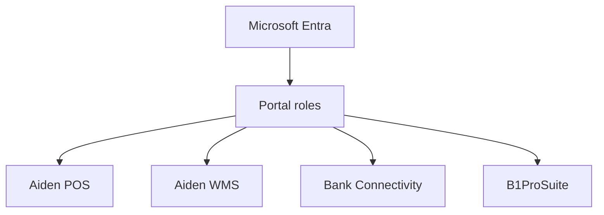

# User management and Microsoft Entra

User and identity pages appear in multiple source spaces, including POS and WMS. GitBook should centralize the shared model and link product-specific instructions back to it.

## Access model

## Recommended content

- Identity provider prerequisites.
- Role mapping by product.
- Admin versus operator permissions.
- Deprovisioning and audit expectations.
- Product-specific login troubleshooting.


Shared identity documentation is a simple way to reduce repeated content across product spaces while keeping product pages focused on workflows.

