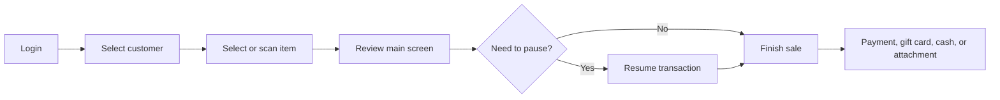

# Aiden POS operations

Aiden POS documentation should give store teams a task-first path through everyday checkout work while keeping admin and hardware setup close by.

## Core transaction flow

## What should live here

- Login and session behavior.
- Selecting a customer and changing customer context.
- Selecting an item manually or through barcode scanner support.
- Understanding the main screen, totals, discounts, and transaction state.
- Pausing and resuming a transaction.
- Finishing a transaction with payment, gift card, cash procedure, attachment, or signature pad.


This is a strong GitBook AI demo page because it gathers the common point-of-sale tasks into one answerable flow instead of scattering them across many small pages.

