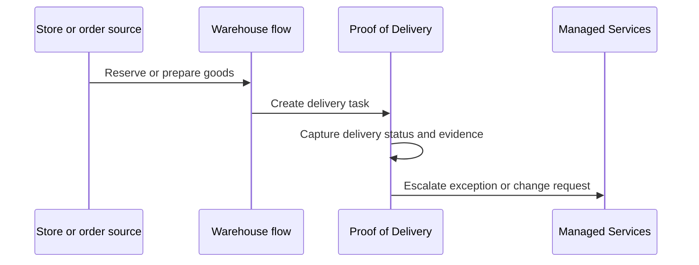

# Proof of Delivery handoff

Proof of Delivery belongs in the same customer journey as order capture, warehouse execution, and exception handling. In GitBook, it can be positioned as the final operational mile instead of a disconnected product tile.

## Handoff model

## Recommended page set

- Delivery task lifecycle.
- Driver or field-user workflow.
- Evidence capture and attachment rules.
- Failed delivery or customer-unavailable handling.
- Operational reporting and exception review.


The current portal exposes Proof of Delivery as its own B1ProSuite product tile. The demo nests it in the retail operating flow so customer journeys are easier to explain.

