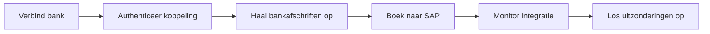

# Integratieplatformen

Deze space brengt Aidens finance- en integratieoppervlakken samen: Bank Connectivity, Aiden Connect, SAP-data-uitwisseling, Peppol, wisselkoersen, betaalworkflows en integratiemonitoring.

<table data-view="cards">
  <thead><tr><th width="48"></th><th></th><th></th><th data-hidden data-card-target data-type="content-ref"></th></tr></thead>
  <tbody>
    <tr><td><i class="fa-building-columns" style="color:#0E8F72;"></i></td><td><strong>Bank Connectivity</strong></td><td>Verbind banken, authenticeer toegang, haal bankafschriften op, beheer organisaties en monitor notificaties.</td><td><a href="bank-connectivity/overview.md">bank connectivity</a></td></tr>
    <tr><td><i class="fa-diagram-project" style="color:#0E8F72;"></i></td><td><strong>Aiden Connect</strong></td><td>Integratiediensten, standaardintegraties, SAP-wisselkoersen, PDF-invoicescanning en Peppol-flows.</td><td><a href="aiden-connect/integration-services.md">integratiediensten</a></td></tr>
    <tr><td><i class="fa-shield-halved" style="color:#0E8F72;"></i></td><td><strong>Controls</strong></td><td>Prerequisites, securitychecks, notificaties, release notes en supportescalatie.</td><td><a href="controls/prerequisites-and-security.md">controls</a></td></tr>
  </tbody>
</table>

## Finance-workflow

