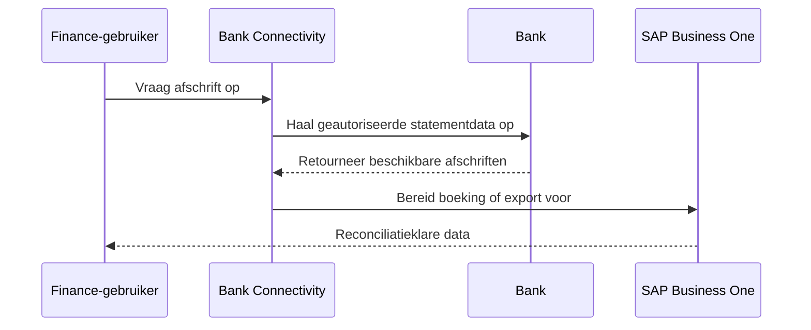

# Bankafschriften ophalen

Het ophalen van bankafschriften is het terugkerende operationele moment waar connectivity, authenticatie en SAP-data-afhandeling samenkomen.

```mermaid
sequenceDiagram
    participant User as Finance-gebruiker
    participant Aiden as Bank Connectivity
    participant Bank as Bank
    participant SAP as SAP Business One
    User->>Aiden: Vraag afschrift op
    Aiden->>Bank: Haal geautoriseerde statementdata op
    Bank-->>Aiden: Retourneer beschikbare afschriften
    Aiden->>SAP: Bereid boeking of export voor
    SAP-->>User: Reconciliatieklare data
```
