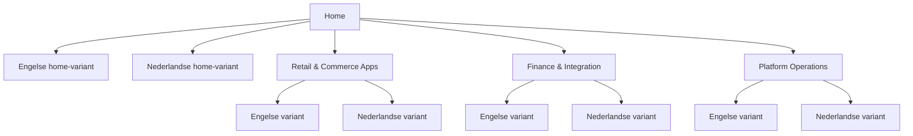

# Aiden Documentatiehub

De documentatie van Aiden omvat point of sale, warehouse operations, bankkoppelingen, integratiediensten, Magento-templates en het B1ProSuite-platform. Gebruik de topnavigatie om een productgebied te kiezen en wissel daarna binnen dezelfde sectie tussen de Engelse en Nederlandse variant.


{% column width="50%" %}
## Start met een productgebied

De demo behoudt Aidens producteigenaarschap, maar geeft klanten drie duidelijkere ingangen: retail- en commerce-apps, finance en integratie, en platform operations.

<a class="button primary" href="https://app.gitbook.com/s/DqwSjKc1rZNdT5YoYuSf/">Bekijk Brancheoplossingen</a>
<button type="button" class="button secondary" data-action="ask" data-query="Met welk Aiden-product start ik voor een retail-rollout?" data-icon="store">Vraag in het Nederlands</button>


{% column width="50%" %}
## Wissel taal via varianten

Elke top-level sectie gebruikt GitBook-varianten voor Engels en Nederlands. De navigatie blijft compact, terwijl elk documentatiegebied in beide talen kan worden bekeken.

<a class="button primary" href="https://app.gitbook.com/s/zhSAY7cZsoNzmKkO0JJ6/">Bekijk de Engelse variant</a>



***

<table data-view="cards">
  <thead><tr><th width="48"></th><th></th><th></th><th data-hidden data-card-target data-type="content-ref"></th></tr></thead>
  <tbody>
    <tr>
      <td><i class="fa-store" style="color:#0E8F72;"></i></td>
      <td><strong>Brancheoplossingen</strong></td>
      <td>Aiden POS, WMS, WarehousePro, Proof of Delivery, RetailPro en Magento-workflows.</td>
      <td><a href="https://app.gitbook.com/s/DqwSjKc1rZNdT5YoYuSf/">Brancheoplossingen</a></td>
    </tr>
    <tr>
      <td><i class="fa-building-columns" style="color:#0E8F72;"></i></td>
      <td><strong>Integratieplatformen</strong></td>
      <td>Bank Connectivity, Aiden Connect, SAP-integratie, betalingen en gemonitorde datastromen.</td>
      <td><a href="https://app.gitbook.com/s/Y7rFrXdON9rXdRex3MXE/">Integratieplatformen</a></td>
    </tr>
    <tr>
      <td><i class="fa-gears" style="color:#0E8F72;"></i></td>
      <td><strong>B1ProSuite</strong></td>
      <td>B1ProSuite-configuratie, identity, user management, support en governance.</td>
      <td><a href="https://app.gitbook.com/s/PG5nc9B9vXjvJ34jaotJ/">B1ProSuite</a></td>
    </tr>
  </tbody>
</table>

## Variantstructuur


De homepage gebruikt nu hetzelfde taalvariantmodel als de productdocumentatie.

