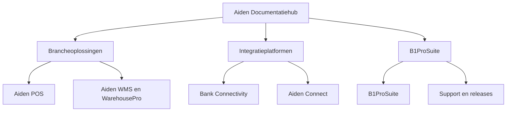

# Aanbevolen GitBook-architectuur

De huidige Aiden-portal is georganiseerd rond productspaces. Dat is logisch voor interne eigenaarschap, maar klanten moeten daardoor eerst het hele portfolio begrijpen. Deze demo houdt producteigenaarschap intact en presenteert minder, duidelijkere routes.

<table data-view="cards">
  <thead><tr><th width="42"></th><th></th><th></th></tr></thead>
  <tbody>
    <tr><td><i class="fa-store" style="color:#0E8F72;"></i></td><td><strong>Brancheoplossingen</strong></td><td>Een route voor Aiden POS, RetailPro, WMS, WarehousePro, Proof of Delivery en Magento-commerce.</td></tr>
    <tr><td><i class="fa-building-columns" style="color:#0E8F72;"></i></td><td><strong>Integratieplatformen</strong></td><td>Een route voor Bank Connectivity, Aiden Connect, betaalstromen, SAP-koppelingen en gemonitorde datastromen.</td></tr>
    <tr><td><i class="fa-gears" style="color:#0E8F72;"></i></td><td><strong>B1ProSuite</strong></td><td>Een route voor B1ProSuite, identity, releases, support en operationele governance.</td></tr>
  </tbody>
</table>

## Waarom deze structuur werkt


Het doel is niet om Aidens productbreedte te verbergen. Het doel is om de eerste klik eenvoudiger te maken en daarna productdetails te behouden.


- Klanten starten met hun operationele doel: retail uitvoeren, financiele systemen koppelen of het platform beheren.
- Productteams houden duidelijke eigenaarschap, omdat pagina's binnen elke space per productgebied kunnen worden gegroepeerd.
- GitBook AI krijgt een schonere contentgraph voor vragen over POS naar bankreconciliatie, warehouse naar delivery of SAP-identity setup.
- Later kan adaptive content diepere implementatiepagina's tonen aan partners en eenvoudigere workflowpagina's aan customer admins.

## Voorgesteld eigenaarschap

