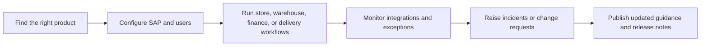

# Aiden Documentation Hub


{% column width="58%" %}
Aiden's current portal spans retail point of sale, warehouse operations, bank connectivity, integration services, Magento templates, and B1ProSuite platform material. This demo keeps that product breadth, but routes visitors by the work they are trying to complete instead of asking them to pick from many separate Confluence spaces.

<a class="button primary" href="https://docs.aiden.eu/">Original portal</a>
<a class="button secondary" href="https://www.aiden.eu/">Aiden website</a>

<button type="button" class="button primary" data-action="ask" data-icon="gitbook-assistant">Ask the Aiden docs</button>
<button type="button" class="button secondary" data-action="ask" data-query="Which Aiden product should I start with for a retail rollout?" data-icon="store">Choose a product path</button> <button type="button" class="button secondary" data-action="ask" data-query="How do I connect SAP, banking, and operational workflows with Aiden?" data-icon="diagram-project">Map integrations</button>


{% column width="42%" %}

**Demo thesis**

GitBook can give Aiden one clearer documentation system for customers, partners, and consultants while preserving the current product-specific depth from Confluence.




***

<table data-view="cards">
  <thead><tr><th width="48"></th><th></th><th></th><th data-hidden data-card-target data-type="content-ref"></th></tr></thead>
  <tbody>
    <tr>
      <td><i class="fa-store" style="color:#0E8F72;"></i></td>
      <td><strong>Retail and commerce apps</strong></td>
      <td>Aiden POS, RetailPro, WarehousePro, WMS, Proof of Delivery, and Magento templates.</td>
      <td><a href="https://app.gitbook.com/s/DqwSjKc1rZNdT5YoYuSf/">retail workflows</a></td>
    </tr>
    <tr>
      <td><i class="fa-building-columns" style="color:#0E8F72;"></i></td>
      <td><strong>Finance and integration</strong></td>
      <td>Bank Connectivity, Aiden Connect, payment workflows, SAP integration, Peppol, and monitored data flows.</td>
      <td><a href="https://app.gitbook.com/s/Y7rFrXdON9rXdRex3MXE/">finance and integration</a></td>
    </tr>
    <tr>
      <td><i class="fa-gears" style="color:#0E8F72;"></i></td>
      <td><strong>Platform operations</strong></td>
      <td>B1ProSuite setup, identity, user management, support escalation, releases, and governance model.</td>
      <td><a href="https://app.gitbook.com/s/PG5nc9B9vXjvJ34jaotJ/">platform operations</a></td>
    </tr>
  </tbody>
</table>

## A better route through the same product family

## What this first draft shows

- A unified landing page that explains the portfolio before splitting into product-specific tasks.
- Cleaner space boundaries for commercial demos: retail operations, finance/integration, and platform operations.
- GitBook-native cards, hints, steppers, tabs, Mermaid diagrams, and AI prompts so the demo feels materially different from a flat Confluence portal.
- A migration path where Aiden can keep product teams owning their spaces while customers experience one connected documentation portal.
