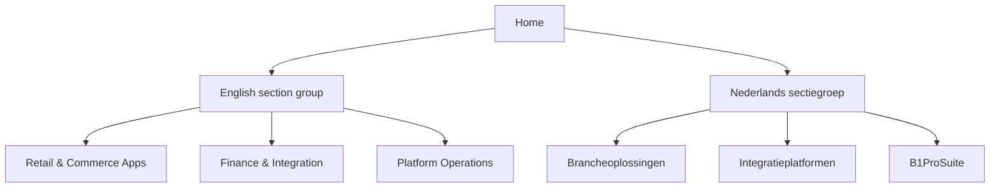

# Aiden Documentation Hub / Aiden Documentatiehub


{% column width="50%" %}
## English

Aiden's documentation spans retail point of sale, warehouse operations, bank connectivity, integration services, Magento templates, and B1ProSuite platform material. Use the English group in the top navigation to browse the same demo structure in English.

<a class="button primary" href="https://app.gitbook.com/s/zhSAY7cZsoNzmKkO0JJ6/">Browse English docs</a>
<button type="button" class="button secondary" data-action="ask" data-query="Which Aiden product should I start with for a retail rollout?" data-icon="store">Ask in English</button>


{% column width="50%" %}
## Nederlands

De documentatie van Aiden omvat point of sale, warehouse operations, bankkoppelingen, integratiediensten, Magento-templates en het B1ProSuite-platform. Gebruik de groep Nederlands in de topnavigatie om dezelfde demo in het Nederlands te bekijken.

<a class="button primary" href="https://app.gitbook.com/s/DqwSjKc1rZNdT5YoYuSf/">Bekijk Nederlandse docs</a>
<button type="button" class="button secondary" data-action="ask" data-query="Met welk Aiden-product start ik voor een retail-rollout?" data-icon="store">Vraag in het Nederlands</button>



***

<table data-view="cards">
  <thead><tr><th width="48"></th><th></th><th></th><th data-hidden data-card-target data-type="content-ref"></th></tr></thead>
  <tbody>
    <tr>
      <td><i class="fa-language" style="color:#0E8F72;"></i></td>
      <td><strong>English</strong></td>
      <td>Retail & Commerce Apps, Finance & Integration, and Platform Operations.</td>
      <td><a href="https://app.gitbook.com/s/zhSAY7cZsoNzmKkO0JJ6/">English docs</a></td>
    </tr>
    <tr>
      <td><i class="fa-language" style="color:#0E8F72;"></i></td>
      <td><strong>Nederlands</strong></td>
      <td>Brancheoplossingen, Integratieplatformen en B1ProSuite.</td>
      <td><a href="https://app.gitbook.com/s/DqwSjKc1rZNdT5YoYuSf/">Nederlandse docs</a></td>
    </tr>
  </tbody>
</table>

## Structure / Structuur


This homepage is intentionally bilingual. The product spaces are duplicated by language so the demo can show a clear two-language navigation model without relying on browser translation.

