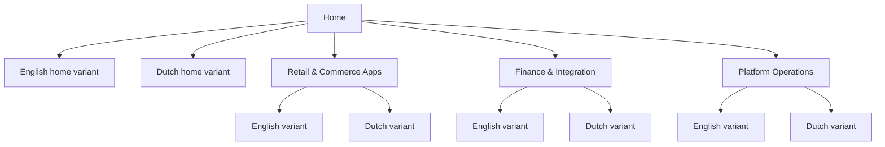

# Aiden Documentation Hub

Aiden's documentation spans retail point of sale, warehouse operations, bank connectivity, integration services, Magento templates, and B1ProSuite platform material. Use the top navigation to choose a product area, then switch the language variant to English or Dutch from the same section.


{% column width="50%" %}
## Start with a product area

The demo keeps Aiden's product ownership intact, but gives customers three clearer entry points: retail and commerce apps, finance and integration, and platform operations.

<a class="button primary" href="https://app.gitbook.com/s/zhSAY7cZsoNzmKkO0JJ6/">Browse Retail & Commerce Apps</a>
<button type="button" class="button secondary" data-action="ask" data-query="Which Aiden product should I start with for a retail rollout?" data-icon="store">Ask in English</button>


{% column width="50%" %}
## Switch language by variant

Each top-level section uses GitBook variants for English and Dutch, so the navigation stays compact while every documentation area can be reviewed in either language.

<a class="button primary" href="https://app.gitbook.com/s/DqwSjKc1rZNdT5YoYuSf/">View the Dutch variant</a>



***

<table data-view="cards">
  <thead><tr><th width="48"></th><th></th><th></th><th data-hidden data-card-target data-type="content-ref"></th></tr></thead>
  <tbody>
    <tr>
      <td><i class="fa-store" style="color:#0E8F72;"></i></td>
      <td><strong>Retail & Commerce Apps</strong></td>
      <td>Aiden POS, WMS, WarehousePro, Proof of Delivery, RetailPro, and Magento workflows.</td>
      <td><a href="https://app.gitbook.com/s/zhSAY7cZsoNzmKkO0JJ6/">Retail & Commerce Apps</a></td>
    </tr>
    <tr>
      <td><i class="fa-building-columns" style="color:#0E8F72;"></i></td>
      <td><strong>Finance & Integration</strong></td>
      <td>Bank Connectivity, Aiden Connect, SAP integration, payments, and monitored data flows.</td>
      <td><a href="https://app.gitbook.com/s/iv3CeSi0kcOPL7wlDPUQ/">Finance & Integration</a></td>
    </tr>
    <tr>
      <td><i class="fa-gears" style="color:#0E8F72;"></i></td>
      <td><strong>Platform Operations</strong></td>
      <td>B1ProSuite setup, identity, user management, support, and governance.</td>
      <td><a href="https://app.gitbook.com/s/6BWvsL79RmFuTOcaOXZ5/">Platform Operations</a></td>
    </tr>
  </tbody>
</table>

## Variant structure


The homepage now follows the same language-variant model as the product documentation sections.

