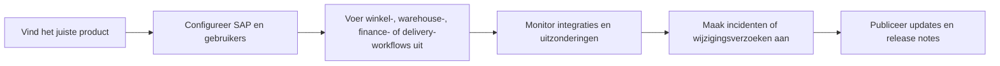

# Aiden Documentatiehub


{% column width="58%" %}
De huidige Aiden-portal bevat documentatie voor point of sale, warehouse operations, bankkoppelingen, integratiediensten, Magento-templates en het B1ProSuite-platform. Deze demo behoudt die productbreedte, maar helpt bezoekers eerst kiezen op basis van het werk dat ze willen doen.

<a class="button primary" href="https://docs.aiden.eu/">Huidige portal</a>
<a class="button secondary" href="https://www.aiden.eu/">Aiden website</a>

<button type="button" class="button primary" data-action="ask" data-icon="gitbook-assistant">Vraag het aan de Aiden docs</button>
<button type="button" class="button secondary" data-action="ask" data-query="Met welk Aiden-product start ik voor een retail-rollout?" data-icon="store">Kies een productpad</button> <button type="button" class="button secondary" data-action="ask" data-query="Hoe verbind ik SAP, bankkoppelingen en operationele workflows met Aiden?" data-icon="diagram-project">Breng integraties in kaart</button>


{% column width="42%" %}

**Demo-these**

GitBook kan Aiden een duidelijker documentatiesysteem geven voor klanten, partners en consultants, zonder de bestaande productdiepte uit Confluence kwijt te raken.




***

<table data-view="cards">
  <thead><tr><th width="48"></th><th></th><th></th><th data-hidden data-card-target data-type="content-ref"></th></tr></thead>
  <tbody>
    <tr>
      <td><i class="fa-store" style="color:#0E8F72;"></i></td>
      <td><strong>Brancheoplossingen</strong></td>
      <td>Aiden POS, RetailPro, WarehousePro, WMS, Proof of Delivery en Magento-templates.</td>
      <td><a href="https://app.gitbook.com/s/DqwSjKc1rZNdT5YoYuSf/">retailworkflows</a></td>
    </tr>
    <tr>
      <td><i class="fa-building-columns" style="color:#0E8F72;"></i></td>
      <td><strong>Integratieplatformen</strong></td>
      <td>Bank Connectivity, Aiden Connect, betaalstromen, SAP-integratie, Peppol en gemonitorde datastromen.</td>
      <td><a href="https://app.gitbook.com/s/Y7rFrXdON9rXdRex3MXE/">finance en integratie</a></td>
    </tr>
    <tr>
      <td><i class="fa-gears" style="color:#0E8F72;"></i></td>
      <td><strong>B1ProSuite</strong></td>
      <td>Installatie, configuratie, identity, gebruikersbeheer, support, releases en governance.</td>
      <td><a href="https://app.gitbook.com/s/PG5nc9B9vXjvJ34jaotJ/">platformbeheer</a></td>
    </tr>
  </tbody>
</table>

## Een betere route door dezelfde productfamilie

## Wat deze demo laat zien

- Een centrale startpagina die het portfolio uitlegt voordat bezoekers naar producttaken gaan.
- Een duidelijke sectiegroep `Productgebieden` met drie routes die aansluiten op de huidige portal: Brancheoplossingen, Integratieplatformen en B1ProSuite.
- GitBook-native cards, hints, steppers, tabs, Mermaid-diagrammen en AI-prompts.
- Een migratiepad waarbij Aiden productteams eigenaar laat blijven van hun content, terwijl klanten een verbonden documentatie-ervaring krijgen.
