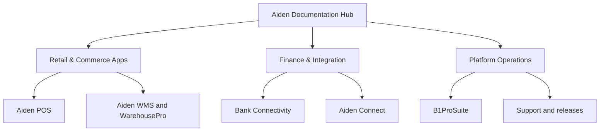

# Recommended GitBook Architecture

The current Aiden portal is organized around product spaces. That makes sense for internal ownership, but customers first need to understand the full portfolio before they can choose the right path. This demo keeps product ownership intact while presenting fewer, clearer routes.

<table data-view="cards">
  <thead><tr><th width="42"></th><th></th><th></th></tr></thead>
  <tbody>
    <tr><td><i class="fa-store" style="color:#0E8F72;"></i></td><td><strong>Retail & Commerce Apps</strong></td><td>One route for Aiden POS, RetailPro, WMS, WarehousePro, Proof of Delivery, and Magento commerce.</td></tr>
    <tr><td><i class="fa-building-columns" style="color:#0E8F72;"></i></td><td><strong>Finance & Integration</strong></td><td>One route for Bank Connectivity, Aiden Connect, payment flows, SAP connections, and monitored data flows.</td></tr>
    <tr><td><i class="fa-gears" style="color:#0E8F72;"></i></td><td><strong>Platform Operations</strong></td><td>One route for B1ProSuite, identity, releases, support, and operational governance.</td></tr>
  </tbody>
</table>

## Why this structure works


The goal is not to hide Aiden's product breadth. The goal is to simplify the first click, then preserve product detail underneath.


- Customers start from their operational goal: run retail, connect finance systems, or manage the platform.
- Product teams keep clear ownership because pages inside each space can still be grouped by product area.
- GitBook AI gets a cleaner content graph for questions that move from POS to bank reconciliation, warehouse to delivery, or SAP to identity setup.
- Later, adaptive content can show deeper implementation pages to partners and simpler workflow pages to customer admins.

## Proposed ownership model

