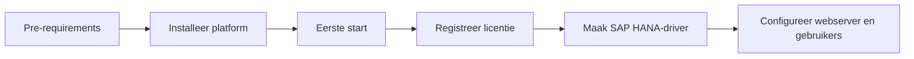

# B1ProSuite

Deze space verzamelt de content die Aidens productportfolio operationeel maakt: B1ProSuite-installatie, configuratie, identity, supportescalatie, releases en governance.

<table data-view="cards">
  <thead><tr><th width="48"></th><th></th><th></th><th data-hidden data-card-target data-type="content-ref"></th></tr></thead>
  <tbody>
    <tr><td><i class="fa-server" style="color:#0E8F72;"></i></td><td><strong>B1ProSuite</strong></td><td>Pre-requirements, installatie, eerste start, licentieregistratie, HANA-driver en webconfiguratie.</td><td><a href="b1prosuite/overview.md">overzicht</a></td></tr>
    <tr><td><i class="fa-user-shield" style="color:#0E8F72;"></i></td><td><strong>Access en identity</strong></td><td>Gebruikers, Microsoft Entra, portalrollen en toegangscontrole voor POS, WMS en platformportalen.</td><td><a href="access/user-management-and-entra.md">accessgids</a></td></tr>
    <tr><td><i class="fa-headset" style="color:#0E8F72;"></i></td><td><strong>Support en governance</strong></td><td>Managed Services portal, incidenten, wijzigingsverzoeken, release notes en documentatieproces.</td><td><a href="access/managed-services-support.md">supportmodel</a></td></tr>
  </tbody>
</table>

## Platform setup-flow

