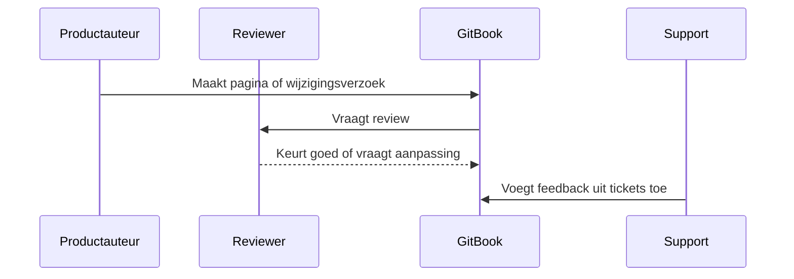

# Documentatie operating model

Aidens huidige Confluence-model weerspiegelt waarschijnlijk producteigenaarschap. GitBook kan dat behouden en daar review-, publicatie- en analytics-workflows aan toevoegen.

## Voorgestelde governance

- Product owners zijn verantwoordelijk voor accuratesse per productgebied.
- Een centrale documentatie-eigenaar bewaakt navigatie, naamgeving, redirects en duplicatie.
- Support levert feedback vanuit terugkerende tickets.
- Implementatiepartners kunnen later adaptieve of afgeschermde setup-pagina's krijgen.

