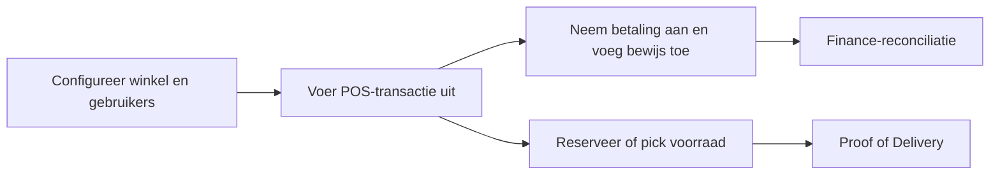

# Brancheoplossingen

Deze space brengt de operationele documentatie samen die nu verspreid is over Aiden POS, Aiden WMS, RetailPro, WarehousePro, Proof of Delivery en Magento-templates.

<table data-view="cards">
  <thead><tr><th width="48"></th><th></th><th></th><th data-hidden data-card-target data-type="content-ref"></th></tr></thead>
  <tbody>
    <tr><td><i class="fa-cash-register" style="color:#0E8F72;"></i></td><td><strong>Point of sale</strong></td><td>Inloggen, klantselectie, artikelkeuze, kasprocedures, cadeaubonnen, bijlagen en betalingen.</td><td><a href="workflows/aiden-pos-operations.md">POS-operaties</a></td></tr>
    <tr><td><i class="fa-warehouse" style="color:#0E8F72;"></i></td><td><strong>Warehouseflows</strong></td><td>WMS-client, portalinstellingen, definities, voorraadconversie, binlocaties en dagelijkse afhandeling.</td><td><a href="workflows/warehouse-and-wms-operations.md">warehouse-operaties</a></td></tr>
    <tr><td><i class="fa-truck" style="color:#0E8F72;"></i></td><td><strong>Delivery en commerce</strong></td><td>Proof of Delivery, Magento-templates, hardware, randapparatuur en veldworkflows.</td><td><a href="workflows/proof-of-delivery-handoff.md">delivery-handoff</a></td></tr>
  </tbody>
</table>

## Retail operating model


Voor bankafschriften, betaalbestanden en SAP-integratiepaden ga je verder naar [Integratieplatformen](https://app.gitbook.com/s/Y7rFrXdON9rXdRex3MXE/).

