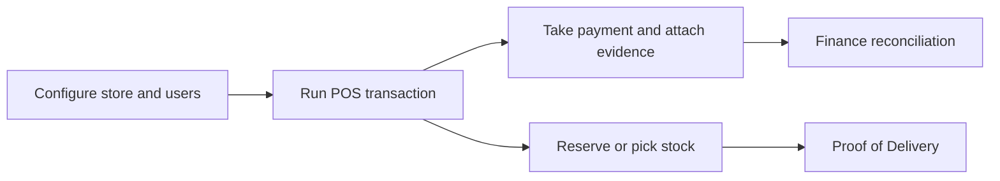

# Retail and commerce apps

This space brings together the operational documentation currently spread across Aiden POS, Aiden WMS, RetailPro, WarehousePro, Proof of Delivery, and Magento templates.

<table data-view="cards">
  <thead><tr><th width="48"></th><th></th><th></th><th data-hidden data-card-target data-type="content-ref"></th></tr></thead>
  <tbody>
    <tr><td><i class="fa-cash-register" style="color:#0E8F72;"></i></td><td><strong>Point of sale</strong></td><td>Login, customer selection, item lookup, cash procedures, gift cards, attachments, and payments.</td><td><a href="workflows/aiden-pos-operations.md">POS operations</a></td></tr>
    <tr><td><i class="fa-warehouse" style="color:#0E8F72;"></i></td><td><strong>Warehouse workflows</strong></td><td>WMS client, warehouse portal settings, definitions, stock conversion, bin locations, and daily handling.</td><td><a href="workflows/warehouse-and-wms-operations.md">warehouse operations</a></td></tr>
    <tr><td><i class="fa-truck" style="color:#0E8F72;"></i></td><td><strong>Delivery and commerce</strong></td><td>Proof of Delivery handoff, Magento templates, hardware, peripherals, and field workflows.</td><td><a href="workflows/proof-of-delivery-handoff.md">delivery handoff</a></td></tr>
  </tbody>
</table>

## Retail operating model


For bank statements, payment files, and SAP integration paths, continue in [Finance and Integration](https://app.gitbook.com/s/XSPACE_FINANCE/).

