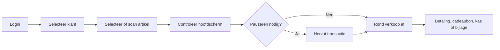

# Aiden POS-operaties

Aiden POS-documentatie moet winkelteams een taakgericht pad geven door dagelijkse checkoutprocessen, met admin- en hardwaresetup dichtbij.

## Kernflow transactie

## Wat hier hoort te staan

- Login- en sessiegedrag.
- Klantselectie en wijzigen van klantcontext.
- Artikelen selecteren via handmatige keuze of barcode scanner.
- Hoofdscherm, totalen, kortingen en transactiestatus begrijpen.
- Transacties pauzeren en hervatten.
- Afronden met betaling, cadeaubon, kasprocedure, bijlage of signature pad.


Dit is een sterke GitBook AI-demopagina, omdat veelvoorkomende POS-taken in een beantwoordbare flow bij elkaar staan.

