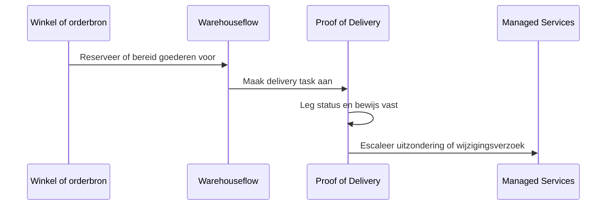

# Proof of Delivery-handoff

Proof of Delivery hoort in dezelfde klantreis als ordervastlegging, warehouse-uitvoering en exception handling. In GitBook kan dit worden gepositioneerd als de laatste operationele stap in plaats van als losse producttegel.

## Handoff-model

## Aanbevolen paginaset

- Lifecycle van delivery tasks.
- Workflow voor chauffeur of field user.
- Bewijsvastlegging en regels voor bijlagen.
- Afhandeling van mislukte levering of afwezige klant.
- Operationele rapportage en exception review.


De huidige portal toont Proof of Delivery als eigen B1ProSuite-producttegel. De demo plaatst het in de retail-operatieflow zodat klantreizen makkelijker uit te leggen zijn.

